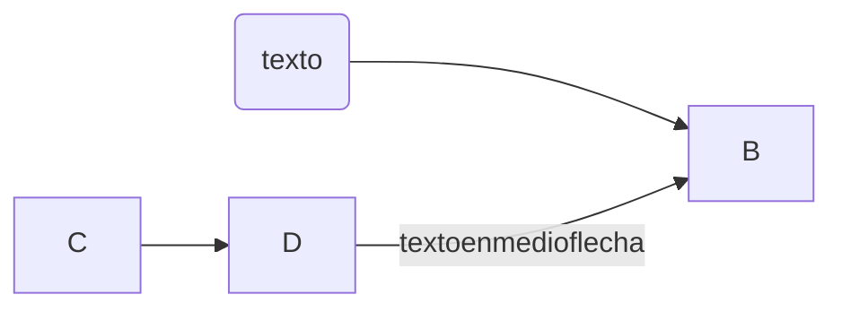

+++
title = 'Markdown'
date = 2024-10-04T13:39:08+02:00
draft = false
weight = 10
+++

# Markdown

Aqui describire como usar markdown
Seccion markdown con tres ficheros aca
(para la practica)_index.md basico.md
avanzado.md
extensiones.md
para ver el texto en negrita escribo
```markdown

**Texto en negrita** texto normal
```
# titulo1
## titulo2
### titulo3




PHP es un lenguaje interesante y bonito



